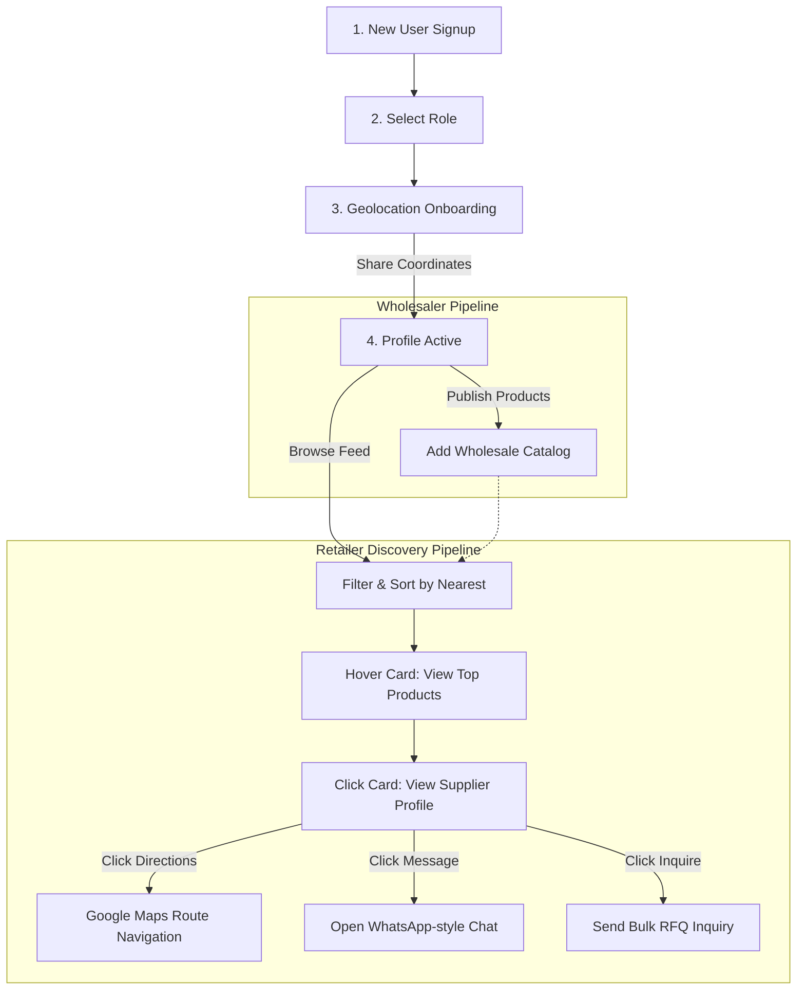

# 📦 DukaanSetu — B2B Connection & Smart Inventory Management System

> A production-grade, highly optimized B2B marketplace and smart inventory management ecosystem built using Express, React (Vite), and Supabase (PostgreSQL). Designed specifically for Indian small retailers (shop owners), distributors, wholesalers, and producers to bridge the supply chain discovery gap.

---

## 🌟 1. Project Overview

### What is DukaanSetu?
**DukaanSetu** (*"Dukaan"* = Shop, *"Setu"* = Bridge) is a B2B marketplace and inventory synchronization platform. While traditional inventory systems only operate within the four walls of a single store, DukaanSetu builds a digital bridge. It serves as an integrated software-as-a-service (SaaS) and network ecosystem that connects independent retail store owners directly with upstream regional wholesalers, distributors, and direct agricultural or industrial producers.

### The Problem It Solves: The B2B Connection Gap
In regional wholesale commerce, retail shops rely on fragmented, offline agent channels to discover suppliers, compare wholesale rates, and place orders. This manual pipeline introduces major inefficiencies:
- **Discovery Bottleneck:** Retailers struggle to find nearby suppliers who stock specific niche brands or offer optimal price tiers.
- **Logistics Inefficiencies:** Without location-aware mapping, retailers often order from far-off distributors, increasing shipping lead times and transportation overheads.
- **Asymmetric Communication:** Negotiating minimum order quantities (MOQ), checking stock availability, or raising bulk RFQs is slowed down by constant phone tags and manual spreadsheet exchanges.
- **Inventory Disconnect:** Retailers operate their internal inventory separately from their purchase cycles, resulting in stockouts of key goods.

**DukaanSetu solves this by uniting a real-time, proximity-based Discovery and RFQ engine with a robust internal business inventory system, creating a single unified procurement and store management experience.**

---

## 🔐 2. Core Features (Existing Foundation)

### Role-Based Access Control (RBAC)
The application defines four major user profiles, each unlocking a customized portal experience:
- **Shop Owner (Retailer):** The end-buyer. Accesses internal inventory controls and the B2B discovery feed to browse, chat, inquire, and buy from wholesale suppliers.
- **Wholesaler:** Bulk supplier. Manages internal stock alongside custom public wholesale product listings with Minimum Order Quantities (MOQs).
- **Distributor:** Mid-tier bulk merchant. Publishes inventories for retail store distribution.
- **Producer:** High-volume raw manufacturer or farmer. Lists primary crop/factory yields to bypass middle-men.

### Product & Inventory Management System
- **Core CRUD Suite:** Full management of brand names, selling/cost prices, unit tags, batch codes, and supplier names.
- **Proactive Alerts:** Integrated background schedulers run daily to identify near-expiry items (7-day threshold) and low-stock items (based on custom user thresholds), triggering immediate warnings.
- **Manual Stock Correction:** API endpoints supporting safe increments or decrements with adjustment audit triggers.

### Categories System
- **Custom Category Builder:** Support for custom classifications with built-in emoji icon Pickers.
- **Validation Guard:** Prevents deletion of categories currently tied to active product listings to ensure structural data integrity.

---

## 🗄️ 3. Database Schema Overview

DukaanSetu is built on Supabase (PostgreSQL), utilizing relational foreign keys, custom enum domains, and composite unique constraints to guarantee transactional reliability.

### Entity Relationship Diagram (ERD)

```mermaid
erDiagram
    users ||--o{ products : "manages internal"
    users ||--o{ wholesaler_products : "publishes public"
    users ||--o{ orders : "places as buyer"
    users ||--o{ connections : "connects as buyer/seller"
    users ||--o{ conversations : "participates"
    users ||--o{ messages : "sends"
    users ||--o{ inquiries : "submits bulk RFQ"
    
    wholesaler_products ||--o{ orders : "referenced in"
    wholesaler_products ||--o{ inquiries : "referenced in"
    conversations ||--o{ messages : "contains"

    users {
        UUID id PK
        TEXT email UNIQUE
        TEXT password_hash
        TEXT shop_name
        TEXT phone_number
        user_role role "shop_owner | wholesaler | distributor | producer"
        BOOLEAN email_verified
        DOUBLE_PRECISION latitude
        DOUBLE_PRECISION longitude
        TEXT address
        TIMESTAMPTZ created_at
    }

    products {
        UUID id PK
        UUID user_id FK
        TEXT product_name
        TEXT brand
        TEXT category
        INTEGER quantity
        TEXT unit
        NUMERIC cost_price
        NUMERIC selling_price
        DATE expiry_date
        TEXT batch_number
        TEXT supplier
    }

    wholesaler_products {
        UUID id PK
        UUID wholesaler_id FK
        TEXT product_name
        TEXT brand
        TEXT category
        NUMERIC price_per_unit
        INTEGER moq
        INTEGER stock_available
        TEXT unit
        TEXT location
        TEXT description
    }

    connections {
        UUID id PK
        UUID shop_owner_id FK
        UUID wholesaler_id FK
        connection_status status "pending | connected | rejected"
        TIMESTAMPTZ created_at
    }

    orders {
        UUID id PK
        UUID buyer_id FK
        UUID product_id FK
        INTEGER quantity
        order_status status "pending | accepted | rejected | shipped | delivered"
        NUMERIC total_price
        TIMESTAMPTZ created_at
    }

    conversations {
        UUID id PK
        UUID user1_id FK
        UUID user2_id FK
        TIMESTAMPTZ created_at
    }

    messages {
        UUID id PK
        UUID conversation_id FK
        UUID sender_id FK
        TEXT message
        TIMESTAMPTZ created_at
    }

    inquiries {
        UUID id PK
        UUID buyer_id FK
        UUID product_id FK
        INTEGER quantity
        TEXT message
        inquiry_status status "pending | responded | closed"
        TIMESTAMPTZ created_at
    }
```

---

## 🚀 4. Newly Added Connection & Discovery Subsystem

We have designed and integrated a real-time, proximity-aware B2B connection ecosystem that bridges retailers with bulk suppliers.

### A. Geolocation & Location Manager
To enable regional discovery, we developed an interactive geolocation capturing workflow:
* **GPS Capture:** Leverages the HTML5 Geolocation API (`navigator.geolocation.getCurrentPosition`) to capture precise coordinate pairs.
* **Manual Input Fallback:** A dedicated modal UI lets users enter standard business addresses, latitudes, and longitudes manually if browser GPS permissions are rejected.
* **Storage & Sync:** Location profiles are securely saved to the `users` table via `PUT /api/profile/location`, immediately updating the user context state across the application.
* **Proximity Use Cases:** Facilitates real-time distance calculation (kilometers) between sellers and buyers and enables point-to-point maps routing.

### B. Wholesaler Profile Card System
Instead of simple product lists, users can search for wholesale suppliers using dynamically aggregated profile cards:
* **Aggregation Logic:** Combines supplier details from `users` with their active inventory in `wholesaler_products`.
* **Proximity Badge:** Displays real-time calculations using the **Haversine formula** (`{distance} km away`) relative to the buyer's coordinates.
* **Pricing & Scale Indicators:** Shows active listed item counts, along with minimum and maximum price ranges (e.g., `₹50 - ₹1,200`).
* **Visual Micro-Animations:** Hovering over a profile card triggers a slide-up list showing the wholesaler's top 3 lowest-priced wholesale items.

### C. Advanced Discovery & Sorting
The discovery engine filters listings via custom query parameters parsed by our backend controllers:
* **Multi-Filter Queries:** Filters results by product or category name, regional location string, and supplier role (Wholesaler, Distributor, or Producer).
* **Smart Sorting:**
  * `nearest`: Sorts dynamically by closest physical distance (Haversine km calculation).
  * `lowest_price`: Sorts suppliers by the lowest-priced wholesale offering.
  * `alphabetical`: Standard sorting by registered company/shop name.

### D. Single Wholesaler Profile View
Clicking a card slides in a dedicated supplier showcase view:
* **View Location CTA (Google Maps Integration):** Opens external turn-by-turn directions using Google Maps:
  `https://www.google.com/maps/dir/?api=1&origin={user_lat},{user_lng}&destination={seller_lat},{seller_lng}`
* **Message & Connect CTA:** Triggers an endpoint that checks for an existing connection. If none is found, it automatically creates a connection (set to `pending`) and opens a direct, private conversation.
* **Digital Catalog:** Displays the supplier's full product catalog with dual interactive options: "Send Inquiry" (bulk requests) and "Order Now" (direct transactions).

### E. WhatsApp-Web Style Chat System
A dual-panel messenger interface designed for instant negotiation:
* **Clean Layout:** The left column lists active chat partners (complete with role badges), and the right column houses the active message thread.
* **Robust Messaging Flow:** Sending a message posts to `/api/chat/conversations/:id/messages` and immediately updates the thread UI.
* **High-Frequency Synchronization:** Implements a highly optimized 3-second backend polling interval to synchronize messages in real-time, providing a seamless chat experience without complex socket overhead.

### F. Inquiry System (RFQ Style)
For large bulk buyers needing customized rates or delivery timelines:
* **RFQ Trigger:** Clicking "Send Inquiry" on any catalog item opens a prefilled modal.
* **Data Context:** Automatically prefills the product name, unit category, and minimum order quantity (MOQ) requirements.
* **Inquiry Tracking:** Submits inquiries to the `inquiries` table, helping wholesalers review and respond to incoming requests.

---

## 🔄 5. End-to-End System Flow



---

## 📡 6. API / Query Examples

### Real-Time Distance Calculation (Haversine Formula)
Implemented in the `discoverProfiles` controller inside `server/controllers/profile.controller.js`. This function calculates distances in-memory, sorts results, and paginates profiles:

```javascript
// Calculate distance dynamically between retailer and wholesaler
let distance = null;
if (req.user?.latitude && req.user?.longitude && item.wholesaler.latitude && item.wholesaler.longitude) {
  const lat1 = req.user.latitude;
  const lon1 = req.user.longitude;
  const lat2 = item.wholesaler.latitude;
  const lon2 = item.wholesaler.longitude;
  
  const R = 6371; // Earth's radius in kilometers
  const dLat = (lat2 - lat1) * Math.PI / 180;
  const dLon = (lon2 - lon1) * Math.PI / 180;
  
  const a =
    Math.sin(dLat / 2) * Math.sin(dLat / 2) +
    Math.cos(lat1 * Math.PI / 180) * Math.cos(lat2 * Math.PI / 180) *
    Math.sin(dLon / 2) * Math.sin(dLon / 2);
    
  const c = 2 * Math.atan2(Math.sqrt(a), Math.sqrt(1 - a));
  distance = R * c; // Distance in km
}
```

### Auto-Establish Connections via Messaging Flow
Implemented in `server/controllers/chat.controller.js` to ensure the `connections` table is updated automatically when a new chat starts:

```javascript
// Check and create a pending B2B connection if starting a conversation
const { data: existingConn } = await supabase
  .from('connections')
  .select('id')
  .eq('shop_owner_id', shop_owner_id)
  .eq('wholesaler_id', wholesaler_id)
  .maybeSingle();

if (!existingConn) {
  await supabase
    .from('connections')
    .insert({
      shop_owner_id,
      wholesaler_id,
      status: 'pending' // Default connection state is pending until verified
    });
}
```

---

## 🎨 7. UI/UX Style & Design Tokens

To maintain a clean and professional appearance, we adhere to a modern SaaS theme using pure CSS variables defined in `/client/src/index.css`:

* **Color Palette:**
  * `--primary` (`#2563EB` - Indigo): For active indicators, primary CTAs, and sender chat bubbles.
  * `--secondary` (`#1E293B` - Slate Blue): For headers and sidebars.
  * `--success` (`#22C55E` - Emerald): Indicating verified items, low-priced highlights, and active states.
  * `--surface` (`#FFFFFF`): For main dashboard components.
  * `--surface-2` (`#F8FAFC` - Soft Slate): For background grids and list views.
* **Component Structures:**
  * **Card Layout:** Built with subtle borders (`1px solid var(--border)`) and smooth transitions (`all 0.3s ease`) to elevate cards slightly on hover.
  * **Tab Navigation:** Styled as inline buttons with clean underline borders to easily switch views without full page reloads.

---

## 🛠️ 8. Tech Stack Summary

| Layer | Component | Description |
|---|---|---|
| **Frontend** | React 18 / Vite | Component-driven UI framework with fast hot-reloading |
| **Routing** | React Router v6 | Client-side routing for seamless page navigation |
| **State & Fetch** | Axios | Configured with automatic bearer headers for secure API requests |
| **Backend** | Express / Node.js | Scalable, controller-pattern REST server |
| **Database** | Supabase (PostgreSQL) | Fully relational storage, foreign keys, triggers, and indices |
| **Auth** | JWT / BCrypt | Access & Refresh token rotation with encrypted credentials |
| **Design** | Pure CSS Variables | Harmonious design layout with zero external framework overhead |

---

## 🚀 9. Setup Instructions & Dev Launch Guide

### Prerequisites
- Node.js v18 or later
- Supabase account (configured with `schema.sql`)

### 1. Installation
Install core package files across both frontend and backend directories:
```bash
# Install root workspace tooling
npm install

# Install server-side Node dependencies
cd server && npm install

# Install client-side React dependencies
cd ../client && npm install
```

### 2. Configure Environment Configurations
Create `.env` config files in their respective folders:

**`server/.env`**
```env
SUPABASE_URL=https://your-project.supabase.co
SUPABASE_SERVICE_ROLE_KEY=your-supabase-service-key

JWT_SECRET=your_jwt_secret_min_32_chars
JWT_REFRESH_SECRET=your_refresh_secret_min_32_chars
JWT_ACCESS_EXPIRY=15m
JWT_REFRESH_EXPIRY=7d
PORT=5000
NODE_ENV=development
CLIENT_URL=http://localhost:5173
```

**`client/.env`**
```env
VITE_API_URL=http://localhost:5000
```

### 3. Launching Development Servers
Run both backend and frontend servers:
```bash
# Terminal 1 - Backend Server
cd server
npm run dev

# Terminal 2 - Frontend Client
cd client
npm run dev
```
- **Local Application URL:** `http://localhost:5173`
- **Local Server API Endpoint:** `http://localhost:5000`

---

## 🔮 10. Future Roadmap

1. **Ratings & Reviews:** Allow retailers to review wholesalers based on delivery speed and product accuracy, building trust in the marketplace.
2. **Verification Badges:** Add verified badges for suppliers who submit trade credentials, minimizing transaction risks.
3. **Smart Recommendation Engine:** Highlight high-demand nearby products or suggest close suppliers based on regular purchase patterns.
4. **Interactive Analytics Dashboard:** Provide visual charts for wholesalers to track monthly order statistics, recurring buyers, and popular products.
