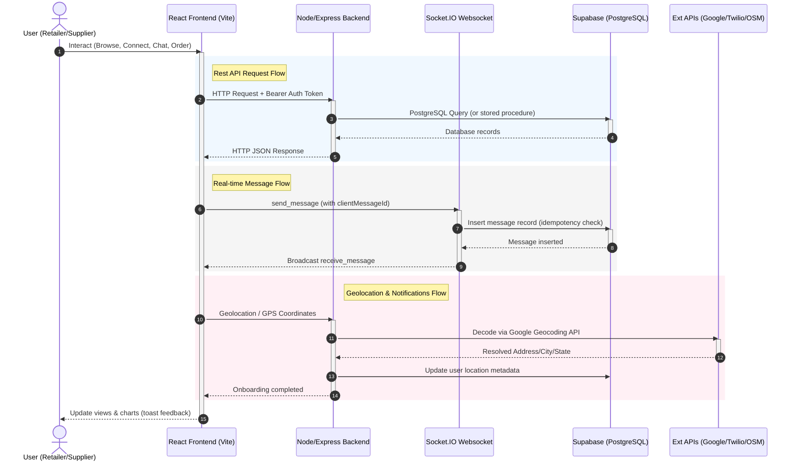

# 🚀 Project Progress Documentation

## 1. 🧾 Project Overview

* **What the project does**: DukaanSetu (formerly StockSync) is a B2B marketplace and smart inventory management system for local shops, distributors, wholesalers, and producers in India.
* **Target users**: Local shop owners (retailers), distributors, wholesalers, and producers.
* **Core purpose**: To bridge the gap between local shop owners and nearby bulk suppliers, enabling seamless B2B connection requests, real-time authenticated chat, inquiry submissions, and order placement while offering a robust local inventory management system with automated low-stock alerts, near-expiry alerts, and barcode scanning support.

---

## 2. 🏗️ Tech Stack

* **Frontend**: React (Vite-powered Single Page Application), TypeScript (for inventory module), JSX, React Router, Tailwind CSS 4, Axios, Zustand, Socket.io-client, Chart.js, GSAP/Framer Motion, `react-hot-toast` for micro-interactions/notifications, and `html5-qrcode` for web-based barcode scanning.
* **Backend**: Node.js, Express web server, Socket.IO for real-time WebSocket communication, Passport.js with Google Strategy, Nodemailer for SMTP email alerts, Twilio SDK for SMS notification alerts, and `node-cron` for scheduling daily system checks.
* **Database**: Supabase (PostgreSQL) with custom Enums, composite indices, foreign keys with cascade deletes, database constraints (e.g. self-connection and self-ordering prevention), trigger functions to manage row update timestamps, and Row-Level Security (RLS) support.
* **Auth**: JWT-based auth (local registration/login) + Google OAuth 2.0 (Passport sessionless flow). Dual token system: short-lived JSON Web Token (Access Token) stored in `localStorage` + secure httpOnly Refresh Token stored in cookies.
* **Hosting/Deployment**:
  * Frontend: Vercel (`https://dukaansetu.vercel.app`)
  * Backend: Render (`https://dukaansetu.onrender.com`)

---

## 3. 📂 Folder & File Structure

Explain important folders and key files with purpose:

* **`/client`**: Frontend codebase directory.
  * **`src/App.jsx`**: Main routing container mapping out public and protected paths (role-specific dashboards and common features).
  * **`src/components/layout`**: Core layout elements including `Footer.jsx`, `Navbar.jsx`, and `Sidebar.jsx`.
  * **`src/components/auth`**: Auth protection helper wrappers `PrivateRoute.jsx` and `RoleRoute.jsx`.
  * **`src/context`**: Global state providers: `AuthContext.jsx` (managing user states, local JWT token storage, login/logout mechanisms) and `ProductContext.jsx` for product state.
  * **`src/features/connect`**: B2B marketplace directory. Consists of `Connect.jsx` (Discovery feed, B2B connections, real-time message chat, geolocation mapping, and orders/inquiry panels).
  * **`src/features/inventory`**: TypeScript-based inventory section. Implements list screens (`InventoryPage.tsx`), modals, forms, and custom state hooks (`useInventory.ts`).
  * **`src/features/orders`**: Contains `Orders.jsx` implementing B2B transaction status controls.
  * **`src/services`**: Shared API configuration clients `api.js` (Axios middleware for JWT inclusion and retry refreshing) and `socket.js` (Socket.IO client integration).
* **`/server`**: Express backend codebase directory.
  * **`server.js`**: Application entry point initiating server config, routes, cron alert schedules, and Socket.IO.
  * **`/config`**: Configuration files: `db.js` (Supabase Postgres client) and `passport.js` (Google OAuth Strategy config).
  * **`/controllers`**: Controller files containing queries and business actions (e.g., `product.controller.js`, `auth.controller.js`, `orders.controller.js`).
  * **`/routes`**: Contains API router configurations (e.g., `auth.routes.js`, `product.routes.js`, `connect.routes.js`).
  * **`/services`**: External integrations: `email.service.js` (Nodemailer), `sms.service.js` (Twilio), `locationService.js` (Google Geocoding), and `barcode.service.js` (Barcode lookup).
  * **`/middleware`**: Routing gates: `auth.middleware.js` (JWT token decoding & Role-Based Access Control) and `validation.middleware.js` (request validation checking).
  * **`/utils`**: Helper utility scripts (e.g., `distance.js` containing geographical Haversine formula, `generateToken.js` for JWT signatures).
  * **`/cron`**: Periodic system scripts: `alertScheduler.js` executing daily email/SMS alerts.
* **`/supabase`**: Contains `schema.sql` (table definitions, enums, triggers, RLS, and B2B ordering stored procedures) and seed data files.

---

## 4. 🔐 Authentication System

* **Signup flow**: Local signup calls POST `/api/auth/signup` providing email, password, shop name, phone number, and user role. The backend generates a salt hash via `bcryptjs`, inserts the user record into the `users` table, signs access/refresh tokens, and returns them (access token in body, refresh token in httpOnly cookie). Note: email verification is auto-completed for MVP purposes.
* **Login flow**: Local login calls POST `/api/auth/login`. Matches email in database, checks for `password_hash` presence (redirects to Google if empty), compares hashes via `bcryptjs`, generates and returns access/refresh tokens.
* **Token system (access + refresh)**:
  * Access Token: Short-lived token signed with `JWT_SECRET` (default `15m` expiry). Contains `id` and `role`. Included in headers as `Authorization: Bearer <token>`.
  * Refresh Token: Long-lived token signed with `JWT_REFRESH_SECRET` (default `7d` expiry). Sent in httpOnly, secure, sameSite cookie.
  * Refresh flow: Axio interceptor captures 401 token expiry error, hits POST `/api/auth/refresh` sending the refresh cookie, retrieves a new access token, and retries the original request.
* **OAuth**: User triggers flow at GET `/api/auth/google`, which redirects to Google OAuth consent. Upon approval, Google redirects back to callback route GET `/api/auth/google/callback`. Passport GoogleStrategy searches for the user by `google_id` or links via existing verified `email` in database. If a new user is encountered, a profile is generated under `shop_owner` role. The callback signs tokens, deposits the refresh cookie, and redirects the browser back to `${CLIENT_URL}/auth/callback?token=<token>&role=<role>`.
* **Protected routes logic**:
  * Middleware `protect` verifies token signature, checks user validity, normalizes database columns to a camelCase `req.user` payload, and invokes `next()`.
  * Role protection via `requireRole(...roles)` validates that `req.user.role` matches the expected permissions prior to endpoint access.

---

## 5. 🔌 API Endpoints

### Local & OAuth Authentication (`/api/auth`)
* `POST /api/auth/signup`: Create a user account. Returns user info + access token.
* `POST /api/auth/verify-email`: Verify email OTP code (supported via `otp_store`).
* `POST /api/auth/login`: Authenticate with email/password. Returns user info + access token.
* `POST /api/auth/refresh`: Regenerates access token using refresh cookie.
* `POST /api/auth/logout`: Log out user and clear refresh token cookie (requires authentication).
* `GET /api/auth/me`: Fetch details of the currently logged-in user.
* `PUT /api/auth/profile`: Update current user's profile details (shopName, phoneNumber, preferences).
* `PUT /api/auth/change-password`: Update password by validating current password hash.
* `GET /api/auth/google`: Trigger Google OAuth login flow.
* `GET /api/auth/google/callback`: Handle Google callback, set cookies, and redirect to frontend.

### Product Inventory (`/api/products`)
* `GET /api/products`: List and filter products belonging to the logged-in user (supporting search, category filter, stock level status, expiry range, pagination, and sorting).
* `POST /api/products`: Create a new inventory product.
* `GET /api/products/stats`: Retrieve statistics for user's dashboard (total items, low stock tally, expiring soon tally, total inventory value, and category distribution).
* `GET /api/products/top/:userId`: Returns top 3 cheapest wholesale products for a supplier.
* `GET /api/products/:id`: Fetch single product information.
* `PUT /api/products/:id`: Update an inventory product's details.
* `DELETE /api/products/:id`: Remove an inventory product from database.
* `PATCH /api/products/:id/stock`: Make manual stock adjustments (increases/decreases quantity).

### Categories (`/api/categories`)
* `GET /api/categories`: Fetch categories for the current user (includes default seed categories).
* `POST /api/categories`: Add a new custom category.
* `PUT /api/categories/:id`: Rename or modify category.
* `DELETE /api/categories/:id`: Remove category.

### Barcodes (`/api/barcode`)
* `POST /api/barcode/lookup`: Perform external API lookup for barcode details.
* `POST /api/barcode/scan`: Log scan activity inside `scan_history` table.

### B2B Discovery (`/api/profile`)
* `GET /api/profile/discover`: Discover wholesaler, distributor, and producer profiles (supporting geolocation distance calculations, search query, role, price filters, distance proximity, and sorting).
* `GET /api/profile/products/:id`: Get seller's own inventory products.
* `GET /api/profile/:id`: Retrieve supplier details and catalog listings (prices are hidden unless connection status is accepted).
* `POST /api/profile/reverse-geocode`: Decode coordinate points into display addresses.
* `PUT /api/profile/complete`: Mark onboarding steps as completed.
* `PUT /api/profile/location` / `POST /api/profile/update-location`: Save business geocoding location parameters (coordinates, address, city, state).
* `GET /api/profile/recommended`: Get B2B supplier recommendations (ranked by proximity and stock count).
* `GET /api/profile/trending`: List trending supplier products.

### B2B Connections (`/api/connections`)
* `GET /api/connections`: List pending/accepted connections of the authenticated user.
* `POST /api/connections/:userId`: Send a connection request.
* `PUT /api/connections/:id`: Accept or reject an incoming request (recipient only).

### B2B Conversations & Chat (`/api/chat` & `/api/messages`)
* `POST /api/chat/conversations`: Initiate a conversation with a connected user.
* `GET /api/chat/conversations`: Retrieve all active conversations of the logged-in user.
* `GET /api/messages/:conversationId`: Fetch messages inside a conversation (enforced connection check).
* `POST /api/messages`: Send chat message (fallback endpoint if Socket.IO fails).

### Orders (`/api/orders`)
* `POST /api/orders`: Place a new order with a supplier (enforces active connection status, decrements stock).
* `GET /api/orders/buying`: Fetch orders placed by current user.
* `GET /api/orders/selling`: Fetch orders received by current user.
* `GET /api/orders`: Fetch all orders (filterable by role).
* `PUT /api/orders/:id`: Update order state (accept, dispatch, deliver, cancel transitions).

### Notifications (`/api/notifications`)
* `GET /api/notifications`: Retrieve in-app notification alerts.

### Analytics (`/api/analytics`)
* `GET /api/analytics`: Generate analytical reporting cards (total orders, revenues, listings, connections).

---

## 6. 🧠 Core Features

List of working features clearly:

* **User signup & Google OAuth login** ✅
* **Email verification code (OTP)** ✅
* **Onboarding & location setup** ✅: Collects shop metadata, uses device geolocation coords, and reverse-geocodes city/state/address details.
* **Supplier Discovery System** ✅: Browse wholesalers, distributors, and producers. Dynamic map integrations and distance parameters in kilometers.
* **Smart B2B Ranking & Badge assignment** ✅: Rank suppliers based on distance, active catalogs, and profile completion. Assures visibility of `Closest`, `Best Price`, and `Trending` supplier cards.
* **B2B Privacy Gates** ✅: Protects wholesale catalog configurations by hiding listing prices, listing minimum order quantities, and ordering capabilities unless connection requests are `accepted`.
* **B2B Connection Lifecycle** ✅: Bidirectional connection request system with `pending`, `accepted`, and `rejected` statuses.
* **Realtime Chat Messaging** ✅: Instant messaging support using Socket.IO, room separation, message rate limiting, packet de-duplication, and message sync on reconnection.
* **Wholesale Ordering System** ✅: Direct checkout integration. Auto-decrements seller stock upon placing order. Employs a database locked stored function transaction `place_order_tx` to prevent stock race conditions.
* **Inquiry/Catalog Request System** ✅: B2B inquiry/lead tracking for supplier listings.
* **Inventory Management** ✅: Full-featured inventory list page with filters, search, custom categories, paging, and CRUD capabilities.
* **Barcode Scan Logger** ✅: Web-based camera scanner lookup linked to external API queries and scan history tracking.
* **Daily Cron Alerts** ✅: Sweeps database for low stock (`quantity <= threshold`) and expiring products (`expiry_date <= 7 days`), issuing warnings via Nodemailer SMTP emails and Twilio SMS.
* **Marketplace Revenue Analytics** ✅: Summarized graphs of revenue margins, connections activity, and transaction tables.

---

## 7. 🗄️ Database Design

* **Tables and their purpose**:
  * `users`: Main shop profiles (email, hash, role, latitude/longitude, display address, verification status, and notification preferences).
  * `categories`: Categories associated with products (either standard seed defaults or custom creations).
  * `products`: User-specific retail inventory items (quantities, prices, batch codes, supplier data, expiry dates, and alert threshold limits).
  * `wholesaler_products`: Wholesale catalogs published by suppliers for B2B discovery.
  * `orders`: Transacted orders linking a buyer (shop owner), a seller (supplier), a product, quantities, pricing, address, and status.
  * `order_items`: Mapping items involved in multi-product order transactions.
  * `connections`: Connect relationships registry.
  * `conversations`: Chat rooms established between pairs of users.
  * `messages`: Message logs inside conversations (stores text and unique client message ID).
  * `otp_store`: Verification OTP expiry mapping table.
  * `user_status`: User connection presence ledger.
  * `inquiries`: Direct B2B catalog inquiries.
  * `scan_history`: Logs manual stock checks or scanning actions.
* **Relationships**:
  * `products.category_id` references `categories.id`.
  * `wholesaler_products.wholesaler_id` references `users.id` (cascade).
  * `orders.buyer_id` / `orders.seller_id` reference `users.id` (cascade).
  * `orders.product_id` references `wholesaler_products.id` (cascade).
  * `connections.user_id` / `connections.connected_user_id` reference `users.id` (cascade).
* **Important Queries used in code**:
  * Stored transaction function `place_order_tx(p_buyer_id, p_product_id, p_quantity, p_delivery_location, p_notes)` handles stock check validation, locks the wholesaler product row using `FOR UPDATE`, inserts the order row, and decrements stock atomically to prevent race conditions.
  * Location query gets suppliers in discovery and maps distance using Haversine calculation in JS.

---

## 8. ⚙️ Business Logic

Explain key logic flows:

* **B2B Privacy Gates**: Price sheets, catalog MOQs, and ordering buttons are completely masked or disabled from public viewing unless a connection request has been sent, accepted, and recorded as `status = 'accepted'` in the `connections` table.
* **Matching & Scoring (Smart B2B Ranking)**: Compiles an integer score (weight 100 max) in `Connect.jsx` for sorting suppliers:
  * Product catalog exists: +40
  * Shop has verified GPS coordinates: +30
  * Proximity distance: up to +20 (higher for closer suppliers under 50km)
  * Active online presence: up to +10
* **Haversine Distance**: Calculates the distance in kilometers between two users using coordinates in-memory on the backend (`getDistanceKm`) to support sorting by proximity.
* **Order Status Transitions**: Updates state transitions sequentially:
  * Seller actions: `pending` ➔ `accepted` ➔ `dispatched` ➔ `delivered`.
  * Cancellation: Both buyers and sellers can change status to `cancelled` only if order state remains `pending`.
* **Alert Sweep Logic**: Daily cron checks at 9:00 AM:
  * Low Stock Alert: triggers if `quantity <= low_stock_threshold`. If `quantity <= 5`, sends Twilio SMS.
  * Expiring Alert: triggers if `expiry_date` is within 7 days. If within 3 days, sends Twilio SMS.

---

## 9. 🌐 Frontend Functionality

* **Pages available**:
  * `Landing`: B2B landing page.
  * `Login` / `Signup` / `AuthCallback`: Accounts registration, login, and social redirect handler.
  * `Onboarding`: GPS geolocation activation.
  * `ShopOwnerDashboard` / `DistributorDashboard` / `WholesalerDashboard` / `ProducerDashboard`: Role-specific portals showing alerts, revenue charts, and tables.
  * `Products`: Core inventory table, CSV/Excel export, scan controls, and CRUD modals.
  * `Categories`: Category creation grid.
  * `Connect`: Interactive tab window grouping discovery, active relationships, chat rooms, and order checklists.
  * `Connections`: Connect requests ledger.
  * `Orders`: Status updates tracker.
  * `Reports`: Total valuation trends.
  * `Settings`: Profile preferences, security passwords, and notifications toggle.
* **State management**:
  * Context states (`AuthContext`, `ProductContext`) hold active sessions.
  * Modular states inside pages (`Connect.jsx`, `Orders.jsx`) fetch database queries via Axios API clients.
* **API Integration**: Centralized Axios client (`api.js`) featuring JWT injection, automatic token refresh redirection, response contract logging warnings, and toast errors.

---

## 10. 🔁 Realtime / Socket Features

* **Connection logic**: Client connects to backend Socket.IO server by passing the active JWT token inside the handshake auth parameter (`socket.handshake.auth.token`).
* **Events**:
  * `join_conversation`: Joins a room identified by the UUID of the conversation.
  * `send_message`: Emits messages with message properties and a client-side generated UUID (`clientMessageId`).
  * `receive_message`: Broadcasts incoming packets to room recipients.
  * `user_online` / `user_offline`: Syncs online/offline indicator dots on chat headers.
* **Data sync behavior**: On socket reconnection, the client automatically triggers an HTTP refresh of the last 20 messages to ensure no packet loss occurred during network failures.

---

## 11. 🔑 Environment Variables

List of required variables:

* `SUPABASE_URL`: Supabase project endpoint.
* `SUPABASE_SERVICE_ROLE_KEY`: Service role client token (bypasses Row-Level Security for backend processes).
* `JWT_SECRET`: Signature secret for short-lived access tokens.
* `JWT_REFRESH_SECRET`: Signature secret for long-lived refresh tokens.
* `JWT_ACCESS_EXPIRY`: Lifespan duration for access tokens (e.g., `15m`).
* `JWT_REFRESH_EXPIRY`: Lifespan duration for refresh tokens (e.g., `7d`).
* `GOOGLE_CLIENT_ID` / `GOOGLE_CLIENT_SECRET` / `GOOGLE_CALLBACK_URL`: Google OAuth settings.
* `EMAIL_HOST` / `EMAIL_PORT` / `EMAIL_USER` / `EMAIL_PASS`: SMTP email credentials (e.g., Gmail App Password).
* `TWILIO_ACCOUNT_SID` / `TWILIO_AUTH_TOKEN` / `TWILIO_PHONE_NUMBER`: Twilio SMS credentials.
* `GOOGLE_MAPS_API_KEY`: API key for Google Maps Reverse Geocoding.
* `PORT`: Backend port (default `5000`).
* `NODE_ENV`: App runtime environment (`development` / `production`).
* `CLIENT_URL` / `SERVER_URL`: Frontend and backend domains for CORS permissions and redirects.

---

## 12. 🚀 Deployment Status

* **Backend**: Hosted on Render (`https://dukaansetu.onrender.com`).
* **Frontend**: Hosted on Vercel (`https://dukaansetu.vercel.app`).
* **CI/CD**: Connected directly to GitHub repository branches; automatically builds and triggers deployments on push to `main`.

---

## 13. ⚠️ Known Issues / Risks

* *OTP Email verification is bypassed on local signup* (Auto-verify is enabled by default to simplify local onboarding for the MVP).
* *API key fallback*: Location updates fall back to Kolkata coordinates in development if the Google Maps API key is missing or fails.
* *B2B Score distance estimation* is computed in-memory (using JS latitude/longitude distance calculation), which is highly performant but shifts computation load to backend memory when discover listing parameters swell.
* *Orders table structure*: While `order_items` table is defined, placing orders currently writes order details directly to single-product columns in the `orders` table.

---

## 14. 📈 Current Completion Status

* **Estimated Completion**: ~95%
* **Remaining Tasks**:
  * Multi-item shopping cart processing support.
  * Integration testing of SMS/Email triggers in production environments.

---

## 15. 🧩 Dependencies & Integrations

* **External APIs**: Google Geocoding API, OpenStreetMap Nominatim API, Barcode lookup API.
* **Third-Party Services**: Supabase (Postgres), Google OAuth, Twilio SMS Gateway, Gmail SMTP.
* **Libraries**: React Router, Axios, Zustand, Chart.js, GSAP, Framer Motion, Nodemailer, Passport.js, Node-cron, Socket.IO.

---

## 16. 🧭 How Everything Connects

