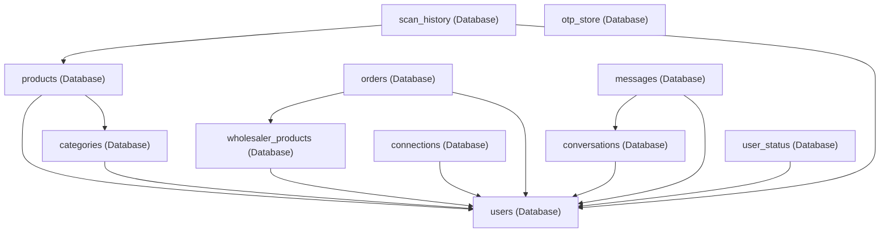

# 🧠 System Map (DO NOT BREAK VERSION)

This document maps the real, implemented system architecture, execution flows, and module dependencies of DukaanSetu.

---

## 1. 🔗 Core Execution Flows (MOST IMPORTANT)

### Auth Flow
```
User (Credentials)
  └─► Frontend React SPA (Form submit)
        └─► POST /api/auth/login
              ├─► Express Server
              │     └─► Supabase select where email = input
              │           └─► bcryptjs.compare(password, hash)
              │                 ├─► Sign Access Token (JWT_SECRET)
              │                 └─► Sign Refresh Token (JWT_REFRESH_SECRET)
              ├─► Set httpOnly Cookie (refreshToken)
              └─► HTTP Response: { accessToken, user }
                    └─► client localStorage.setItem('accessToken')
```

### Refresh Token Flow
```
Client Request (Expired JWT) ──► HTTP 401 (expired: true)
  └─► Axios Response Interceptor (api.js)
        ├─► POST /api/auth/refresh
        │     └─► Express reads httpOnly Cookie (refreshToken)
        │           └─► jwt.verify(refreshToken, JWT_REFRESH_SECRET)
        │                 └─► Query users table
        │                       └─► Sign new Access Token
        ├─► HTTP Response: { accessToken }
        ├─► Client localStorage.setItem('accessToken', new_token)
        └─► Re-execute original HTTP Request with new Bearer token
```

### Google OAuth Flow
```
User Click "Google Login"
  └─► GET /api/auth/google
        ├─► passport.authenticate('google', scope: ['profile', 'email'])
        └─► Redirect to accounts.google.com
              └─► Google Auth Callback redirects back to:
                    └─► GET /api/auth/google/callback
                          ├─► Passport GoogleStrategy
                          │     ├─► Query users table by google_id or email
                          │     │     ├─► If matches: update google_id + verify email
                          │     │     └─► If new: insert user (role: 'shop_owner')
                          ├─► Sign tokens & Set httpOnly cookie (refreshToken)
                          └─► Redirect: CLIENT_URL/auth/callback?token=access_token&role=user_role
                                └─► AuthCallback.jsx
                                      ├─► Store token in localStorage
                                      ├─► GET /api/auth/me (fetch context profile)
                                      └─► Redirect to role-specific dashboard path
```

### Chat Flow (Socket + fallback API)
```
User Sends Message (Connect.jsx)
  ├─► Generate UUID clientMessageId (idempotency check)
  ├─► Socket.IO connected?
  │     ├─► YES: socket.timeout(5000).emit('send_message', data, ack)
  │     │     ├─► server socket checkRateLimit (10 msg/sec limit)
  │     │     ├─► check database for clientMessageId duplicate
  │     │     ├─► insert message in Supabase
  │     │     ├─► broadcast receive_message in socket room
  │     │     └─► trigger ACK callback to client
  │     └─► NO / TIMEOUT / ERROR: Fallback to REST API
  └─► POST /api/messages
        ├─► Check B2B connection exists in Supabase
        ├─► Supabase select messages where client_message_id = input
        │     ├─► Duplicate found: return existing message (dedup)
        │     └─► No duplicate: insert message record
        └─► Return JSON response
```

### Order Placement Flow (with DB transaction)
```
Buyer Click "Order"
  └─► POST /api/orders
        ├─► Check connections table: user_id & connected_user_id
        │     ├─► status != 'accepted' ──► Return HTTP 403 (Forbidden)
        ├─► Query product details in wholesaler_products
        │     ├─► Verify stock availability
        │     └─► Verify quantity >= MOQ
        ├─► Stored Database Procedure place_order_tx() Execution (or server fallback):
        │     ├─► Lock wholesaler_products row (SELECT FOR UPDATE)
        │     ├─► Decrement stock: stock_available - quantity
        │     └─► Insert record in orders table (status: 'pending')
        └─► Return JSON response of placed order
```

### Inventory CRUD Flow
```
User Page Interaction (InventoryPage.tsx)
  ├─► useInventory Hook (useInventory.ts)
  │     └─► axios api.js HTTP Request 
  │           ├─► GET /api/products (filters: page, limit, search, category, stockLevel, sorting)
  │           ├─► POST /api/products (insert category_id, name, prices, batch, quantity)
  │           ├─► PUT /api/products/:id (update properties)
  │           └─► DELETE /api/products/:id (delete row)
  └─► Adjustments logged in scan_history table
```

---

## 2. 🔄 Dependency Graph



### Dependency Rules:
1. **Orders**: Depend on `wholesaler_products` (the item listing) and `users` (both `buyer_id` and `seller_id`). Orders cannot exist without active, corresponding user records.
2. **Chat (Messages)**: Depends directly on `conversations` (a conversation room linking two user IDs) and `users` (the message sender).
3. **Connections**: Depend on `users` (`user_id` and `connected_user_id`). The connection ledger acts as the gatekeeper for messaging and ordering.
4. **Inventory (Products)**: Depends on `categories` (must belong to a category) and `users` (owner of the retail stock).

---

## 3. ⚠️ Critical Couplings (DANGER ZONE)

* **Order Placement relies on Connections**: In [orders.controller.js](file:///d:/Projects/DukaanSetu/server/controllers/orders.controller.js#L66-L78), the API rejects ordering requests with `403` if a record with status `accepted` does not exist in the `connections` table for the buyer and seller.
* **Pricing visibility depends on Connection status**: In [profile.controller.js](file:///d:/Projects/DukaanSetu/server/controllers/profile.controller.js#L548-L554), when fetching a seller profile, catalog listing prices and MOQs are set to `null` on the response payload if the connection is not accepted.
* **Socket auth depends on JWT_SECRET**: Sockets verify tokens via `jwt.verify(token, process.env.JWT_SECRET)` during the connection handshake. If the secret differs or key structure is modified, real-time sync completely fails.
* **Axios Interceptor ties token expiry to 401 responses**: The axios client [api.js](file:///d:/Projects/DukaanSetu/client/src/services/api.js#L75-L101) intercepts 401 errors, checking `error.response?.data?.expired`. If the structure of the API error changes on the server, automated token refresh retries fail, causing abrupt user logouts.

---

## 4. 🔐 Sensitive Logic (DO NOT TOUCH)

* **Supabase Service Role Bypass**: The server DB connector in [db.js](file:///d:/Projects/DukaanSetu/server/config/db.js#L15-L20) initializes Supabase with the `SUPABASE_SERVICE_ROLE_KEY`. This bypasses Row Level Security (RLS). Changing this to a standard anon key will block backend controller updates unless detailed PostgreSQL policy definitions are written for all tables.
* **Transactional Stored Function**: The PostgreSQL stored procedure `place_order_tx()` locks the `wholesaler_products` row (`FOR UPDATE`) to prevent race conditions during checkout. Bypassing this or writing standard server-side updates introduces double-booking/negative inventory vulnerabilities.
* **Socket ID Handshake Auth Middleware**: Sockets execute JWT decode on connection handshakes in [socket.js](file:///d:/Projects/DukaanSetu/server/services/socket.js#L64-L75). Modifying this middleware blocks socket connections.
* **Idempotency Client Message Index**: The `messages` table maps a unique index on `client_message_id`. Backend and socket layers enforce this to reject duplicate message uploads.

---

## 5. 🧱 Stable vs Risky Areas

### Stable (safe to modify UI only)
* Landing page style sheets and page elements.
* Categories creation UI and styling files.
* Dashboard charts and analytics reporting widgets.
* Sidebar and navigation styles.

### Medium Risk
* Inventory layout additions and filters parsing.
* Onboarding GPS detection component logic.
* Order list status filter buttons.
* Profile settings panel fields.

### High Risk (core logic)
* `AuthContext` token verification operations.
* Axios interceptor `api.js` request/response filters.
* Express passport configuration.
* Backend `orders` status update state transitions.
* Websocket room handlers and message idempotency filters.
* Database triggers and schema structures.

---

## 6. 🔁 Hidden Logic / Implicit Behavior

* **Auto Stock Deduction**: When placing an order, the supplier's product stock count is immediately decremented by the requested quantity. If the status shifts to `cancelled`, stock levels must be manually replenished (not automated in basic transitions).
* **Chat Reconnection Sync**: The socket layer includes an auto-reconnect flag. When reconnecting, it invokes `fetchLastMessages()` which retrieves the last 20 messages via HTTP, merging them in-memory to prevent lost messages during temporary network drops.
* **Cron Daily Sweeps**: The alert scheduler executes daily at 9:00 AM. It updates `alert_low_stock` and `alert_expiring_soon` booleans directly on product rows in the database, while sending emails and Twilio SMS.
* **Location Fallbacks**: Geolocation lookup falls back to Kolkata coordinates in development if the `GOOGLE_MAPS_API_KEY` is not present in `.env`.

---

## 7. 🚫 Breaking Scenarios

* **If connection mapping structure changes** ──► Wholesaler price catalogs immediately mask prices, and ordering endpoints throw `403` access errors.
* **If JWT payload properties (like `role`) change** ──► `requireRole` middleware rejects access, blocking dashboard logins, and frontend routes default back to the landing page.
* **If Supabase database RLS gets turned on without service-role key** ──► Backend controllers fail to fetch or mutate tables.
* **If Socket server port setup changes** ──► Clients fail to connect, causing instant fallback to Rest HTTP routes.

---

## 8. 🧭 Safe Extension Points

* **New APIs**: New sub-routing files can be added in `/server/routes` and wired in `server.js` (e.g., product reviews, billing reports, or document uploads).
* **New UI Pages**: New page routes can be added in `App.jsx` under `PrivateRoute` for non-core pages (e.g., bulk discount catalogs, store analytics graphs, help centers).
* **Additional Analytics**: Adding database queries inside `analytics.controller.js` to compute extra transaction ratios is safe.
* **External Integrations**: Adding other SMTP servers or payment gateway connectors inside backend services is safe as long as they do not block basic transactional routines.
